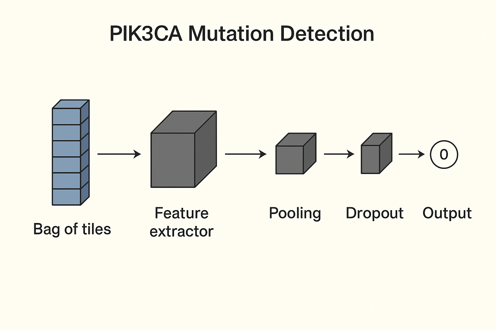

# PIK3CA Mutation Detection 🧬

This repository details my approach to the Owkin PIK3CA mutation detection challenge, a weakly-supervised binary classification problem on histopathology images.

## 🔬 The Challenge

The objective of this challenge was to predict whether a patient carried a PIK3CA gene mutation based on a high-resolution histopathology slide. This mutation is found in 30-40% of breast cancers and is associated with a specific therapeutic response, making its detection highly relevant for personalized medicine.

Due to the extremely large size of digital histopathology slides (often > 100,000x100,000 pixels), a weakly-supervised approach called Multiple-Instance Learning (MIL) was necessary. The data provided for the challenge consisted of a "bag" of 1000 tiles (224x224 pixels) per slide, with only the entire slide having a binary label (mutated or not). The model had to learn how to aggregate information from these tiles to make a global prediction.

Below is an example of a full histopathology slide:

And here's how these slides are broken down into smaller "tiles" for processing:

The data was pre-processed by Owkin: for each tile, features were extracted using a Wide ResNet-50-w2 model pre-trained on the TCGA-COAD dataset (histopathology images of colon cancer). This resulted in a 1000 x 2048 feature matrix for each slide.

## 👉 My Approach

My approach was guided by two key principles: simplicity and efficiency. I aimed to build a lightweight model that could achieve strong performance without requiring extensive computational resources, which was a significant constraint (my GPU allocation was limited to Google Colab). The ultimate goal was to match the winning score with the fewest possible parameters.

### 🧠 Model Architecture

My model consists of a simple yet effective encoder-decoder architecture:

* **Encoder (CNN):** A Convolutional Neural Network (CNN) was used as the encoder. The choice of a CNN was deliberate, as the Wide ResNet-50-w2 features used as input are based on convolutional layers and therefore retain the geometrical structure of the data. The CNN's role was to identify and learn the most relevant features from the input vectors, outputting a new 2048-feature vector for each tile.
* **Decoder (Max Pooling):** A Max Pooling layer was used to intelligently aggregate the features from the 1000 tiles for each slide. This operation is a core component of the MIL paradigm, allowing the model to focus on the most expressive pathological regions within the slide, making the approach robust to noisy or uninformative tiles.

I also used dropout and callbacks to prevent overfitting and improve the model's generalization.

### 💡 Why a Simple Model?

There were several reasons for opting for a minimalist model:

* **Computational Constraints:** My work was limited by the Google Colab GPU allocation. A larger, more complex model wasn't feasible.
* **Performance vs. Complexity:** I found that adding depth and complexity to the model didn't significantly improve its performance on the validation set.
* **Environmental Responsibility:** A smaller model is more environmentally friendly due to its lower computational cost.
* **Personal Goal:** My personal objective was to achieve a score similar to the winner's with a model that had significantly fewer parameters (my model had around 2,500 parameters, while the winner's had approximately 10,000).

## 📊 Results

My model successfully achieved an AUC score of 0.66 on the public test set, a result that matched the winning score of the challenge. This was accomplished with a significantly lower number of parameters, demonstrating that a simple, computationally efficient model can be highly effective in this context.

You can verify this result on the official challenge public ranking page, where my submission is listed under the username billel_asn.

## 🚀 Future Improvements

To enhance the model's performance and robustness, I would consider the following axes for future work:

* **Addressing Data Heterogeneity:** The dataset was sourced from five different centers, with the training data coming from three centers and the test data from the remaining two. This disparity likely introduced a domain shift that negatively impacted the model's generalization.
* **Leveraging Transfer Learning:** The pre-calculated features from MoCo v2 were a great starting point, but exploring different pre-trained models or fine-tuning could yield better feature representations.
* **Data Augmentation with Diffusion Models:** Training a diffusion model on the image tiles (or the MoCo features themselves) could generate synthetic tiles. This would be particularly useful for augmenting the minority class, addressing the class imbalance issue and potentially improving the model's ability to detect the mutation.

## 📚 References

My approach to this weakly-supervised problem was inspired by the work of Wei et al., specifically their methodology for detecting genetic markers in RNA sequences without precise localization, which aligns with the core principles of Multiple-Instance Learning.

* Wei, J., Lee, J., Liu, Y., Zhang, W., Chen, J., & Shi, Y. (2022). Predicting m6A sites from RNA sequence using deep learning. *Nature Methods*, *25*(6), 1147-1155.
